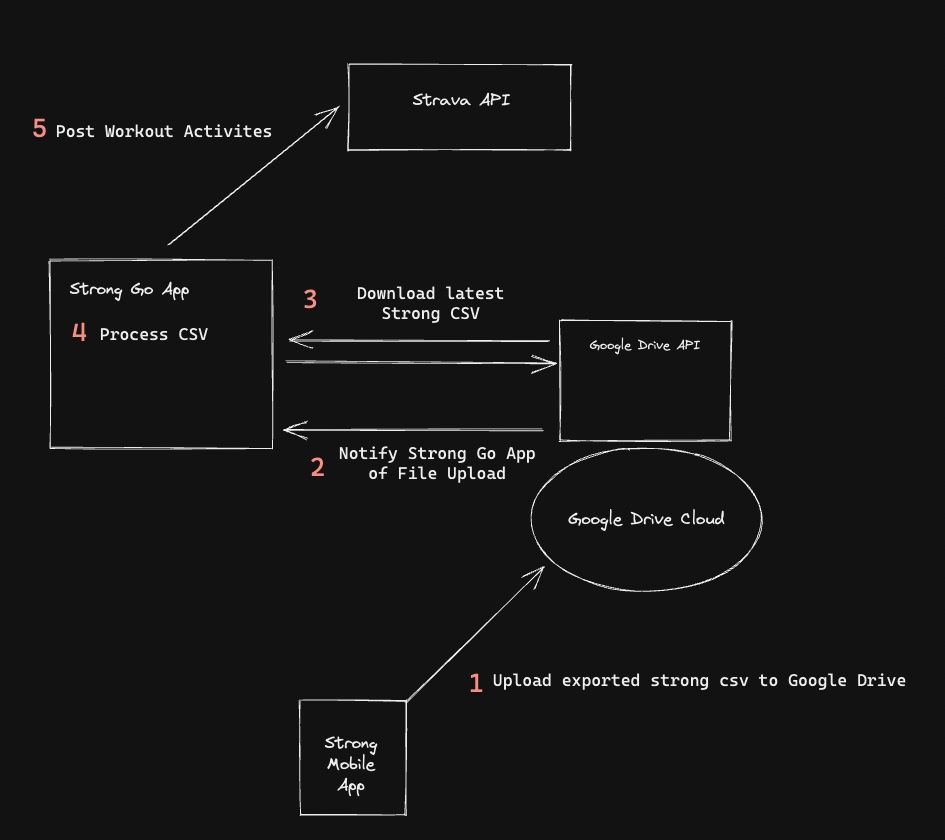

# strong
[strong app](https://www.strong.app/) workout logs published to [strava](https://www.strava.com/)

# Phase 1 - Program Behavior Goals
- Read the strong app csv workout log file locally
- Parse and convert workouts to Go workout structs
- Only send strong workouts to Strava API if they do not exist

# Phase 2 - Program Behavior Goals
- On a timer, pull the strong app csv workout log file from Google Drive API
- Read the strong.csv workout log file
- Parse and convert workouts to Go workout structs
- Only send strong workouts to Strava API if they do not exist

# Project Structure (DRAFT - WIP)
- `bin`: contains compiled application binaries, ready for deployment to a production server
- `cmd/api`: contains application-specific code for the Strong API application. Includes the code for running the server, reading and writing HTTP requests and managing authentication.
- `internal`: contains various ancillary packages used by the Strong API. It will contain the code for interacting with external services, doing data validation and so on. Basically, any code which isn’t application-specific and can potentially be reused will live in here. The Go code under cmd/api will import the packages in the internal directory (but never the other way around).
- `remote`: contains the configuration files and setup scripts for the production server
- `go.mod`: file will declare our project dependencies, versions and module path.
- `Makefile`: file will contain recipes for automating common administrative tasks — like auditing the Go code, building binaries, and executing various commands

## The Power of Go Tests

"write calling code that is sensible, readable, and useful, and only then proceed to implement everything necessary to make it work."

"The most important reason to write tests first is that, to do that, we need to have a clear idea of how the program should behave, from the user’s point of view. There’s some thinking involved in that, and the best time to do it is before we’ve written any code."

# Google Drive API
- [Google Drive API](https://developers.google.com/drive/api) - [Google Workspace](https://developers.google.com/workspace/guides/get-started) - [Google Drive Activity API](https://developers.google.com/drive/activity/v2)

## Research
- VSCode extention to work with csv files: Edit CSV
- Golang csv libraries
    - Standard library: https://pkg.go.dev/encoding/csv@go1.19.3
easy-working-with-csv-in-golang-using-gocsv-package-9c8424728bbe
    - External:
        - https://github.com/gocarina/gocsv
                - https://articles.wesionary.team/read-and-write-csv-file-in-go-b445e34968e9
                - https://articles.wesionary.team/
        - https://github.com/jszwec/csvutil